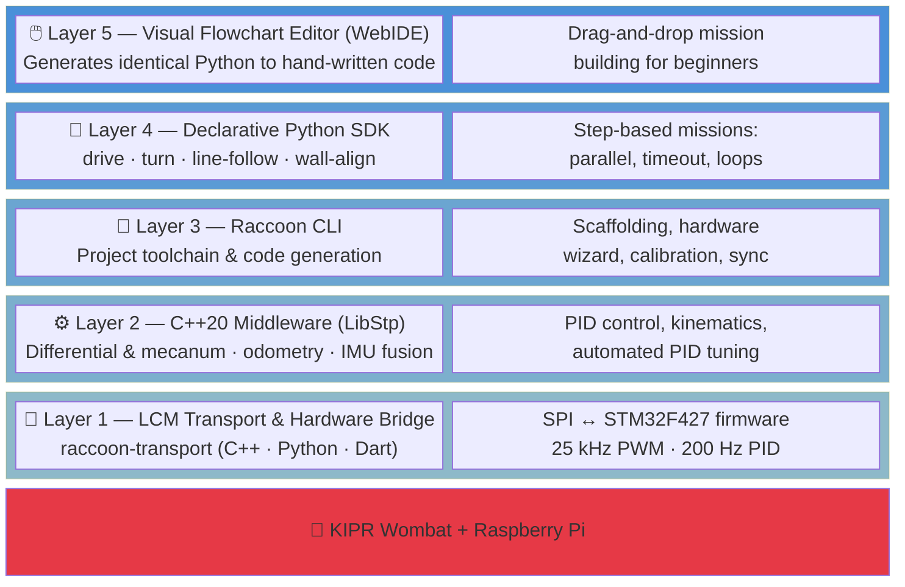

### Autonomous robotics · [HTL St. Pölten](https://www.htlstp.ac.at/) · Austria

Competing in [Botball](https://www.botball.org/) & [ECER](https://ecer.botball.org/)

*"Raise the Floor, Don't Lower the Ceiling"*

---

## What We Do

We build autonomous robots that compete on a game table — navigating, detecting objects, and completing missions with zero human input. Our platform, **RaccoonOS**, is a full custom stack running on the [KIPR Wombat](https://www.kipr.org/kipr/hardware/botball-controller-wombat) controller, from bare-metal firmware up to a visual programming environment.

## RaccoonOS Architecture

Five layers, one shared LCM communication backbone — no capability gaps between beginner and expert workflows.

## Repositories

| Repository | Description | Tech |
|:-----------|:-----------|:-----|
| **[raccoon-lib](https://github.com/htl-stp-ecer/raccoon-lib)** | Core robotics library — PID control, kinematics, odometry, step-based missions |   |
| **[raccoon-transport](https://github.com/htl-stp-ecer/raccoon-transport)** | LCM-based inter-process messaging with reliable delivery |    |
| **[raccoon-cli](https://github.com/htl-stp-ecer/raccoon-cli)** | Development toolchain — scaffolding, hardware wizard, codegen, remote sync |  |
| **[Firmware-Stp](https://github.com/htl-stp-ecer/Firmware-Stp)** | Bare-metal STM32F427 firmware — motor PID, servo, IMU, SPI bridge |  |
| **[stm32-data-reader](https://github.com/htl-stp-ecer/stm32-data-reader)** | Raspberry Pi ↔ STM32 SPI bridge, publishes sensor data via LCM |  |
| **[botui](https://github.com/htl-stp-ecer/botui)** | StpVelox — on-robot Flutter desktop environment with dashboard & sensor viz |  |
| **[raccoon-cam](https://github.com/htl-stp-ecer/raccoon-cam)** | High-performance camera streaming with LCM integration |  |
| **[documentation](https://github.com/htl-stp-ecer/documentation)** | Technical docs site |  |
| **[spring-2026-gametable](https://github.com/htl-stp-ecer/spring-2026-gametable)** | ESP32-C3 drum dispenser controller with Next.js web UI |   |
| **[Papers-and-Documentations](https://github.com/htl-stp-ecer/Papers-and-Documentations)** | Research papers & competition documentation archive |  |

## Beyond the Stack

**Computer Vision** — YOLOv11 object detection trained on real footage and synthetic data from our Unity-based simulator with randomized camera angles, lighting, and object placement.

**Path Planning** — A\* pathfinder with correction-weighted costs that prefers routes along walls and lines, giving the robot tactile feedback for mid-mission self-correction instead of relying on dead reckoning.

**On-Robot UI** — StpVelox, a custom Flutter desktop environment running directly on the Pi via flutter-pi, with a real-time dashboard, sensor visualization, camera feed, and WiFi management.

**Custom OS** — StpOs, a reproducible Raspberry Pi image built with our own image creator, pre-configured with all RaccoonOS services.

---

**St. Pölten, Austria** · [htlstp.ac.at](https://www.htlstp.ac.at/)

